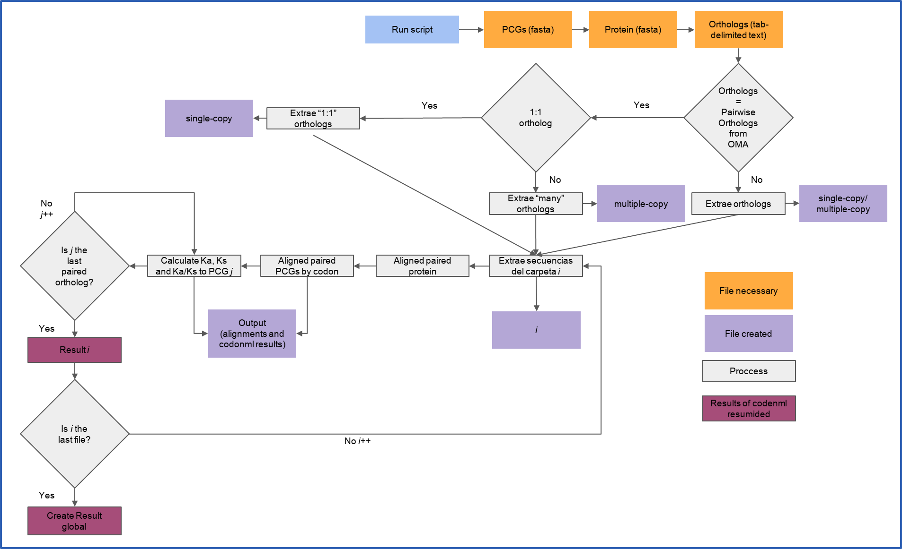

# PANAS 
## Pipeline for the Analysis of Nonsynonymous And Synonymous substituions
PANAS v.1 is a pipeline built for Linux.


## Prerequisites
Various external programs are required to be in the global directory and accesible from any working directory.
  1. PAML, available at http://abacus.gene.ucl.ac.uk/software/paml.html  (version 4.9j is used). [Click to download](http://abacus.gene.ucl.ac.uk/software/paml4.9j.tgz).  
  2. ParaAT, available at https://github.com/wonaya/ParaAT (version 2.0 is used). [Click to download](https://github.com/wonaya/ParaAT/archive/refs/heads/master.zip).    
      ParaAT requires having at least one of the following sequence aligners clustalw2, t_coffee, mafft or     muscle. Some of them can be installed from Linux command line. Example:  
```
-bash-4.4$ sudo apt-get install mafft
```
To make the program accessible from any working directory, add it to your PATH variable. In bash you can add ~/.bash_profile using the following commands:  

```
-bash-4.4$ nano ~/.bash_profile
```
Type and save the following lines:  
```
export PATH=$PATH:~/your/path/directory/paml4.9j/src/
export PATH=$PATH:~/your/path/directory/ParaAT-master/
```
Then run on the command line:  
```
-bash-4.4$ source ~/.bash_profile
```
**Import note:** PAML may have compile time problems if you have gcc 11.2.0. To fix the problem, you can install the gcc 9.4.0 version which can be installed with the following command:  
```
-sudo apt-get install -y gcc-9
```
Then, modify the src/Makefile by replacing "cc" with "gcc-9" on line 2. With this change PAML should be correctly installed.  


## Main Options  
  - `-p` Directory containing the protein file(s) in Fasta format. If you ran OMA to get ortholog information, the "DB" file can be used, only with the Fasta. Required parameter.  
  - `-n` Directory containing the nucleotide file(s) in Fasta format. Required parameter.    
  - `-o` Directory containing information on orthologous groups. If you ran OMA, you can use the "PairwiseOrthologs" file. However, you can use tab-delimited text files in which each row represents an orthologous group with two columns. See example in the Input data section. Required parameter.  
  - `-z` Process number used during alignment. It is used by the ParaAT program. Required parameter.  
  - `-a` Aligner used. Depending on the alignment program you have installed, you can choose one of the following: "clustalw2", "t_coffee", "mafft" or "muscle"). Default: mafft. Optional parameter.  
  - `-g` Genetic Code used. Default value: 1 (The Standard Code). For more information see the documentation of [ParaAT](https://ngdc.cncb.ac.cn/tools/paraat/doc). Optional parameter.    
  - `-t` Format type of the file(s) containing orthologous group information. You can choose one of the following: "OMA" or "other". If the data of the orthologous groups correspond to the PairwiseOrthologs format of OMA, choose "OMA". Required parameter.      
  - `-s` You can choose between the parameters: "single-copy" or "multiple-copy". Allows you to choose wheter to perform the analysis using only the information from orthologous genes with a 1:1 ratio ("single-copy"), or orthologous groups of multiple copies, such as 1:many, many:1, and many:many ("multiple-copy"). Useful parameter if your information comes from OMA. If your information is not in the OMA "PairwiseOrthologs" format, you can choose either. Required parameter.   
  - `-h` Help   
  
**Import note:** Each gene must have the same code in its nucleotide and amino acid sequence. However, the code from one gene should not be repeated in another gene. Don't use "@" in sequence codes.  


## Input data  
The pipeline requires four files. See Examples.  
    - Directory with file(s) containing multiple amino acid sequences.  
    - Directory with file(s) containing multiple nucleotide sequences.   
    - Control files that specify the models and options for the analysis. No need to modify anything. Modifying some parameters in the control file can an error.  
    - Directory with file(s) containing orthologous groups. 
      
- Example of OMA "PairwiseOrthologs" format, for the option "-t OMA": 
```
-bash-4.4$ head -n 10 genes_speciesA-genes_speciesB.txt 
# Format: Protein 1<tab>Protein 2<tab>Protein ID1<tab>ProteinID2<tab>Orthology type<tab>OMA group (if any)
# Every pair is listed only once, and in no particular order.
# The map between sequence number and ID are given
# in the file "Map-SeqNum-ID.map
1	1	atp6_Echinococcus_multilocularis_AB018440	atp6_Eudiplozoon_nipponicum_MW704020	1:1	11
2	2	cox1_Echinococcus_multilocularis_AB018440	cox1_Eudiplozoon_nipponicum_MW704020	1:1	1
3	3	cox2_Echinococcus_multilocularis_AB018440	cox2_Eudiplozoon_nipponicum_MW704020	1:1	1
4	4	cox3_Echinococcus_multilocularis_AB018440	cox3_Eudiplozoon_nipponicum_MW704020	1:1	8
5	5	cytb_Echinococcus_multilocularis_AB018440	cytb_Eudiplozoon_nipponicum_MW704020	1:1	2
6	6	nad1_Echinococcus_multilocularis_AB018440	nad1_Eudiplozoon_nipponicum_MW704020	1:1	5
```
- Example of another format, for the option "-t other":
```
-bash-4.4$ head -n 6 genes_speciesA-genes_speciesB.txt 
atp6_Echinococcus_multilocularis_AB018440	atp6_Eudiplozoon_nipponicum_MW704020
cox1_Echinococcus_multilocularis_AB018440	cox1_Eudiplozoon_nipponicum_MW704020
cox2_Echinococcus_multilocularis_AB018440	cox2_Eudiplozoon_nipponicum_MW704020
cox3_Echinococcus_multilocularis_AB018440	cox3_Eudiplozoon_nipponicum_MW704020
cytb_Echinococcus_multilocularis_AB018440	cytb_Eudiplozoon_nipponicum_MW704020
nad1_Echinococcus_multilocularis_AB018440	nad1_Eudiplozoon_nipponicum_MW704020
```

## Starting

  - **Directory**  
  Your directory must contain the following files before running.  

```
-bash-4.4$ tree
.
├── protein_directory
│   ├── speciesA.fa
│   ├── speciesB.fa
│   └── speciesC.fa
├── nucleotide_directory
│   ├── speciesA.fa
│   ├── speciesB.fa
│   └── speciesC.fa
├── codeml.ctl
└── Orthologs
    ├── genes_speciesA-genes_speciesB.txt
    ├── genes_speciesA-genes_speciesC.txt
    └── genes_speciesB-genes_speciesC.txt
```

or

```
-bash-4.4$ tree
.
├── protein_directory
│   └── speciesABC.fa
├── nucleotide_directory
│   └── speciesABC.fa
├── codeml.ctl
└── Orthologs
    ├── genes_speciesA-genes_speciesB.txt
    ├── genes_speciesA-genes_speciesC.txt
    └── genes_speciesB-genes_speciesC.txt
```
  
 - **Running PANAS**  
```
-bash-4.4$ ~/path/PANAS.sh -p protein_directory/ -n nucleotide_directory/ -o Orthologs/ -z 4 -a mafft -g 1 -t OMA -s single-copy
```
  
  - **Output**  
If you choose the "-s single-copy" option, the key output files include:    
    - **single-copy** directory.  
    - **All_results_single-copy**  file.  
If you choose the "-s multiple-copy" option, the key output files include:  
    - **multiple-copy** directory.  
    - **All_results_multiple-copy**  file.  
The **single-copy** or **multiple-copy** directory has information for each pairwise species comparison. For example:  
If the analysis performed pairwise comparison of genes from three species (genes_speciesA vs genes_speciesB; genes_speciesB vs genes_speciesC; genes_speciesA vs genes_speciesC), the directory would contain the following subdirectories "genes_speciesA-genes_speciesB", "genes_speciesB-genes_speciesC" and "genes_speciesA-genes_speciesC".
  
After running PANAS.sh, your directory should look like this:

```
-bash-4.4$ tree
.
├── all.cds
├── all.pep
├── codeml.ctl
├── nucleotide_directory
│   └── speciesABC.fa
├── Orthologs
│   ├── genes_speciesA-genes_speciesB.txt
│   ├── genes_speciesA-genes_speciesC.txt
│   └── genes_speciesB-genes_speciesC.txt
├── proc
├── protein_directory
│   └── speciesABC.fa
├── single-copy
│   ├── genes_speciesA-genes_speciesB.txt.carpeta
│   │   ├── codeml.ctl
│   │   ├── genes_speciesA-genes_speciesB.txt.homologos
│   │   ├── guia.ctl
│   │   ├── output
│   │   │   ├── nad4_Echinococcus_multilocularis_AB018440-nad4_Eudiplozoon_nipponicum_MW704020.cds_aln.paml
│   │   │   ├── nad4_Echinococcus_multilocularis_AB018440-nad4_Eudiplozoon_nipponicum_MW704020.cds_aln.paml.mlc
│   │   │   ├── nad4L_Echinococcus_multilocularis_AB018440-nad4L_Eudiplozoon_nipponicum_MW704020.cds_aln.paml
│   │   │   ├── nad4L_Echinococcus_multilocularis_AB018440-nad4L_Eudiplozoon_nipponicum_MW704020.cds_aln.paml.mlc
│   │   │   ├── nad5_Echinococcus_multilocularis_AB018440-nad5_Eudiplozoon_nipponicum_MW704020.cds_aln.paml
│   │   │   ├── nad5_Echinococcus_multilocularis_AB018440-nad5_Eudiplozoon_nipponicum_MW704020.cds_aln.paml.mlc
│   │   │   ├── nad6_Echinococcus_multilocularis_AB018440-nad6_Eudiplozoon_nipponicum_MW704020.cds_aln.paml
│   │   │   └── nad6_Echinococcus_multilocularis_AB018440-nad6_Eudiplozoon_nipponicum_MW704020.cds_aln.paml.mlc
│   │   ├── Results.genes_speciesA-genes_speciesB.txt.vic
│   │   └── Results.genes_speciesA-genes_speciesB.txt.vic2
│   ├── genes_speciesA-genes_speciesC.txt.carpeta
│   │   ├── codeml.ctl
│   │   ├── genes_speciesA-genes_speciesC.txt.homologos
│   │   ├── guia.ctl
│   │   ├── output
│   │   │   ├── nad4_Echinococcus_multilocularis_AB018440-nad4_Fasciola_hepatica_AF216697.cds_aln.paml
│   │   │   ├── nad4_Echinococcus_multilocularis_AB018440-nad4_Fasciola_hepatica_AF216697.cds_aln.paml.mlc
│   │   │   ├── nad4L_Echinococcus_multilocularis_AB018440-nad4L_Fasciola_hepatica_AF216697.cds_aln.paml
│   │   │   ├── nad4L_Echinococcus_multilocularis_AB018440-nad4L_Fasciola_hepatica_AF216697.cds_aln.paml.mlc
│   │   │   ├── nad5_Echinococcus_multilocularis_AB018440-nad5_Fasciola_hepatica_AF216697.cds_aln.paml
│   │   │   ├── nad5_Echinococcus_multilocularis_AB018440-nad5_Fasciola_hepatica_AF216697.cds_aln.paml.mlc
│   │   │   ├── nad6_Echinococcus_multilocularis_AB018440-nad6_Fasciola_hepatica_AF216697.cds_aln.paml
│   │   │   └── nad6_Echinococcus_multilocularis_AB018440-nad6_Fasciola_hepatica_AF216697.cds_aln.paml.mlc
│   │   ├── Results.genes_speciesA-genes_speciesC.txt.vic
│   │   └── Results.genes_speciesA-genes_speciesC.txt.vic2
│   └── genes_speciesB-genes_speciesC.txt.carpeta
│       ├── codeml.ctl
│       ├── genes_speciesB-genes_speciesC.txt.homologos
│       ├── guia.ctl
│       ├── output
│       │   ├── nad4_Eudiplozoon_nipponicum_MW704020-nad4_Fasciola_hepatica_AF216697.cds_aln.paml
│       │   ├── nad4_Eudiplozoon_nipponicum_MW704020-nad4_Fasciola_hepatica_AF216697.cds_aln.paml.mlc
│       │   ├── nad4L_Eudiplozoon_nipponicum_MW704020-nad4L_Fasciola_hepatica_AF216697.cds_aln.paml
│       │   ├── nad4L_Eudiplozoon_nipponicum_MW704020-nad4L_Fasciola_hepatica_AF216697.cds_aln.paml.mlc
│       │   ├── nad5_Eudiplozoon_nipponicum_MW704020-nad5_Fasciola_hepatica_AF216697.cds_aln.paml
│       │   ├── nad5_Eudiplozoon_nipponicum_MW704020-nad5_Fasciola_hepatica_AF216697.cds_aln.paml.mlc
│       │   ├── nad6_Eudiplozoon_nipponicum_MW704020-nad6_Fasciola_hepatica_AF216697.cds_aln.paml
│       │   └── nad6_Eudiplozoon_nipponicum_MW704020-nad6_Fasciola_hepatica_AF216697.cds_aln.paml.mlc
│       ├── Results.genes_speciesB-genes_speciesC.txt.vic
│       └── Results.genes_speciesB-genes_speciesC.txt.vic2
└── All_results_single-copy
```

## Citation
PANAS: Caña-Bozada, V., Morales-Serna, F.N. 2022. PANAS: pipeline and a case study to obtain synonymous and nonsynonymous substitution rates in  genes of Platyhelminthes.

Please cite the dependencies used:  
PAML:  [Yang, Z. (2007). PAML 4: Phylogenetic Analysis by Maximum Likelihood. Molecular Biology and Evolution, 24(8), 1586-1591.](https://academic.oup.com/mbe/article/24/8/1586/1103731)  
ParaAT: [Zhang, Z., Xiao, J., Wu, J., Zhang, H., Liu, G., Wang, X., & Dai, L. (2012). ParaAT: a parallel tool for constructing multiple protein-coding DNA alignments. Biochemical and Biophysical Research Communications, 419, 779-781.](https://www.sciencedirect.com/science/article/pii/S0006291X12003518)    
  
  
Please also cite the dependencies if used:  
MAFFT: [Katoh, K., & Standley, D. M. (2013). MAFFT multiple sequence alignment software version 7: improvements in performance and usability. Molecular Biology and Evolution, 30, 772-780.](https://academic.oup.com/mbe/article/30/4/772/1073398)  
MUSCLE: [Edgar, R. C. (2004). MUSCLE: multiple sequence alignment with high accuracy and high throughput. Nucleic Acids Research, 32, 1792-1797.](https://academic.oup.com/nar/article/32/5/1792/2380623)  
T-Coffee:  [Notredame, C., Higgins, D. G., & Heringa, J. (2000). T-Coffee: A novel method for fast and accurate multiple sequence alignment. Journal of Molecular Biology, 302, 205-217.](https://www.sciencedirect.com/science/article/pii/S0022283600940427)  
Clustal W: [Larkin, M. A., Blackshields, G., Brown, N. P., Chenna, R., McGettigan, P. A., McWilliam, H., Valentin, F., Wallace, I.M., Wilm, A., Lopez, R., Thompson, J.D., Gibson, T.J., & Higgins, D. G. (2007). Clustal W and Clustal X version 2.0. Bioinformatics, 23, 2947-2948.](https://academic.oup.com/bioinformatics/article/23/21/2947/371686)
  
  
## Flowchart



## Test
The example files are located in Example_pipeline.zip
### Example_1  
This example have information about orthologous group obtained from OMA software.  

To run execute  
```
-bash-4.4$ ~/path/PANAS.sh -p protein_directory/ -n nucleotide_directory/ -o Orthologs/ -z 4 -a mafft -g 1 -t OMA -s single-copy
```


### Example_2  
This example have information about orthologous group obtained from a tab-delimited text file generated manually.   
To run execute  
```
-bash-4.4$ ~/path/PANAS.sh -p protein_directory/ -n nucleotide_directory/ -o Orthologs/ -z 4 -a mafft -g 1 -t other -s single-copy
```


